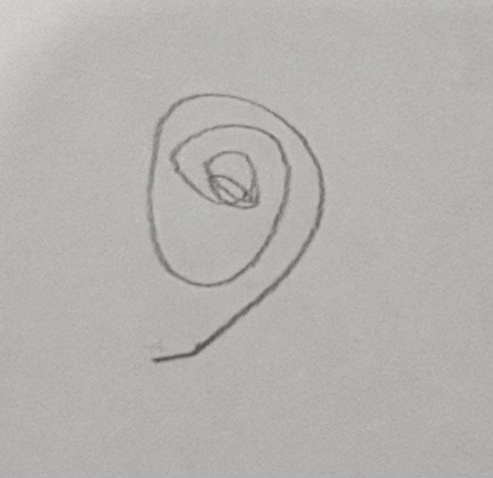

# From a Sketch to a Roller Coaster

This folder is the complete delivery package for the Lucas Academy Golden
Funnel video. The questions in the film were actually asked by a child. The
child did not begin with the words “golden spiral” or with a finished technical
specification. The idea became clear little by little: ask, look at the result,
notice what is wrong, draw what words cannot yet explain, and ask again.

If the finished object were the only goal, someone could request a golden
spiral immediately and receive one. This film deliberately preserves the less
direct route because that route is the valuable part. It shows a child
developing an idea and the language needed to express it—not merely an AI
producing an answer.

All visible text and narration are in English. The mathematics may look
advanced, but the story is written so a child around age ten to twelve can
follow the main idea: **ask, draw, make a rule, test it, and ride it.**

## Original questions and source image

The excerpts below are the real creative prompts that changed the design.
Spelling, capitalization, and mixed Chinese/English wording are preserved.
Production and editing instructions are not included in this question chain.

### Milestone 1 — finding the shape

> I'm making a roller coaster from formula in xy coordinate plane, any
> interesting formula suggestions?

> can we have something make a loop?

> something like this

The last question arrived with this pencil drawing:

- [Unedited visual source (metadata-free PNG copy)](../public/images/roller-coaster/original-sketch-source.png)
- [Mildly enhanced video copy](../public/images/roller-coaster/user-spiral-sketch-enhanced.jpg)

The source copy preserves the uploaded image's dimensions and visible content
without retaining phone metadata. The video cleanup only improves legibility.
The uneven pencil line and handmade shape remain because they are part of the
thinking process.

### Milestone 2 — discovering the mathematical description

> 3d xyz plane like a funal shape spiraling down

The next questions introduced a Möbius Surface as a reference, asked for a
band instead of a line, and named the Fibonacci/golden-spiral direction:

> 参考博物馆 manifold 莫比乌斯环 设计的函数 
> `Surface((6+v cos(u/2)) cos(u),v sin(u/2),(6+v cos(u/2)) sin(u),u,0,2pi,v,-1.3,1.3)` 
> 带曲面的 
> 线条要用 Fibonacci spiral

> 你应该给我一个像 我给你的莫比乌斯环函数那样 一条带状的公式 我要做过山车 
> 函数一开始可以是旋转的漏斗，逐渐转变为golden spiral

Then the child made the constraints more exact:

> 最后的轨道曲面 对了 
> 1. 你不能给我一个surface公式吗？为什么要有很多input之前不需要啊？ 
> 2. surface 从Y 轴往下 最终到0 0 0

> 回到函数，还是要用普通的 funel shap多转3圈，在转换为golden spiral
> 快速收缩 这样比较接近真实过山车

> 我的意思是给我 surface函数

Finally, comparing the funnel and golden versions revealed the desired middle
ground:

> 数学模型还要改，其实想要的是介于漏斗和Golden 之间参数，因为Golden
> 收缩gap太快了，漏斗又太慢，需要一个统一的连贯的 但是比golden收缩慢一些的函数。
> 数学上怎么说呢？是不是反而写起来容易一点呢？

> 给我 GeoGebra Surface for **linearly tapered logarithmic spiral** 和 golden
> 都给我 我比较一下 我看短视频 单纯做 golden 感觉也可以

This sequence matters more than any single answer. The child used each result
to discover a missing requirement: 3D, funnel-shaped, ribbon-like, one Surface,
down the Y-axis, ending at `(0, 0, 0)`, and contracting at a believable rate.
“Golden spiral” was not supplied as a magic answer at the beginning; it emerged
as useful language during the inquiry and was then tested against the child's
own visual judgment.

### Milestone 3 — turning the clarified idea into a world

> Go ahead make it a roller coaster

Only after the mathematical idea had become clear did implementation begin.

## Final videos

- `final-long.mp4` — the complete 16:9 film, 1920 × 1080, 60 fps, 94.05 seconds.
- `final-short-vertical.mp4` — the complete 9:16 social cut, 1080 × 1920,
  60 fps, 59.78 seconds. Milestones 1, 2, and the Agent build are composed
  natively for portrait. Only the real horizontal gameplay is preserved inside
  a vertical presentation instead of being cropped.

The three approved long-form milestone sources are in `clips/`:

1. `01-milestone-1.mp4` — the first questions and the hand-drawn spiral.
2. `02-milestone-2.mp4` — the spiral becomes one 3D Surface.
3. `03-milestone-3-build.mp4` — code, tests, deployment, and `READY TO RIDE`.

Every act change uses a short fade through black. The gameplay source has no
audio, so the final ride is intentionally quiet unless music or sound design is
added later.

## Child-friendly English voice-over

The time ranges below follow `final-long.mp4`. Read warmly and curiously at
about 125–140 words per minute. Leave small gaps so the drawing, formula, word
cloud, and ride can speak for themselves.

### 0:00–0:36 — Milestone 1: a question becomes a sketch

> These are questions a child really asked. He did not begin by saying “golden
> spiral.” He began with a fuzzy idea: a roller coaster made from formulas.

> A finished spiral could have been made at once, but that would skip the
> valuable part. He tried hills, then asked for a loop. When words were not
> enough, he drew this. The rough sketch made the next question possible.

### 0:36–0:58 — Milestone 2: the sketch becomes a Surface

> Now the idea moved into three dimensions: like a funnel, spiraling down. Each
> answer revealed what was still wrong. A line was not a track, so he asked for
> one Surface.

> A funnel tightened too slowly; a golden spiral too quickly. Comparing them
> helped him describe one smooth path between the two, ending at zero.

### 0:58–1:15 — Milestone 3: the Surface becomes a ride

> Only then did he say, “Go ahead, make it a roller coaster.” Code added rails,
> motion, a camera, tests, and a place in the museum.

> The computer moved quickly, but its direction came from the questions that
> had just become clear.

### 1:15–1:34 — Reader and gameplay

> This is the same mathematical Surface. Its wide turns become smaller as the
> path falls toward its final point.

> We can ride the result—but remember, the discovery happened before the ride.
> A fuzzy question became a sketch, then a better question, then a world.

Let the final black frame end in silence. If a separate closing card is added
later, the optional closing line is:

> The important result was not only the spiral. It was learning how to turn an
> unclear idea into a question clear enough to build.

## Narration notes

- Say `phi` like “fye.”
- Say “Surface of U and V”; do not read every symbol in the full equation.
- Do not read the technical word cloud aloud.
- Keep the ride narration sparse so the movement has room to breathe.
- Sound curious and pleased, not like a commercial.
- Do not imply that the AI invented the goal. The child recognized, corrected,
  compared, and clarified the idea; the AI helped make each version visible.
